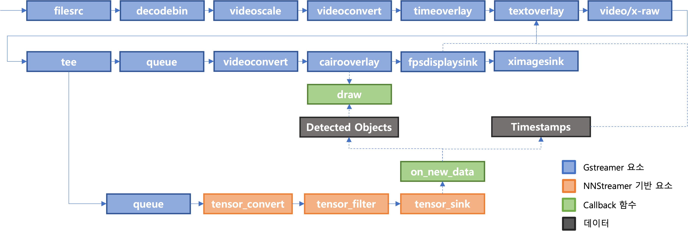
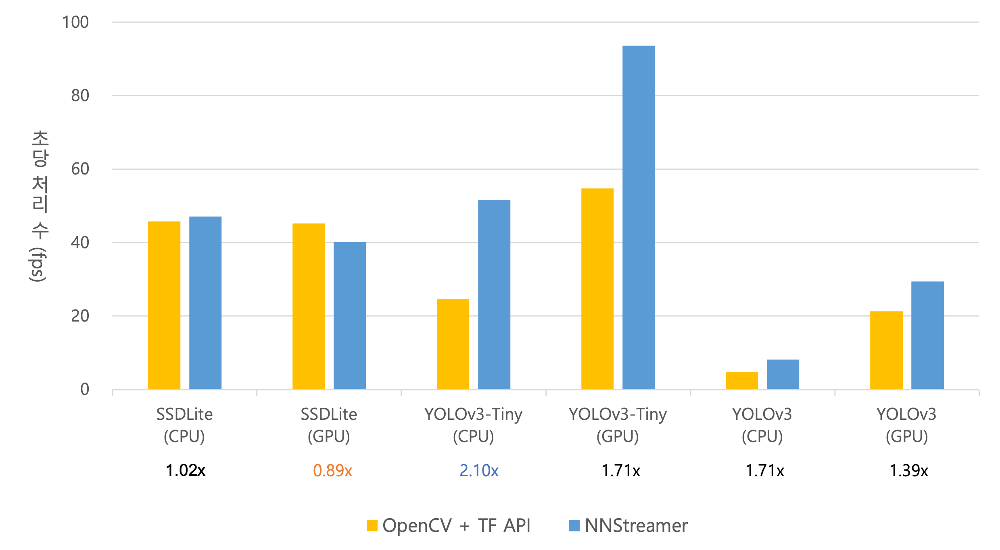

## NNStreamer Pipeline for Object Detection

"NNStreamer를 이용한 실시간 동영상 기반 객체 인식 시스템 설계 (KSC2020)" 논문의 기반이 되는 코드 레포지토리입니다.

([이성주, 최예찬, & 박영준. (2020). NNStreamer 를 이용한 실시간 동영상 기반 객체 인식 시스템 설계. *한국정보과학회 학술발표논문집*, 1559-1561.](https://www.dbpia.co.kr/Journal/articleDetail?nodeId=NODE10530073))

<br/>

### 목차

1. [연구 개요](#연구-개요)
2. [코드 설명](#코드-설명)
3. [코멘트](#코멘트)

<br/>

### 연구 개요

#### 배경

- 영상에 딥러닝 모델을 처리하는 과정을 구현하는 코드 작성 시 파이프라인 기반 프레임워크 활용 시 코드 최적화 및 유지 보수가 용이할 수 있습니다.

<br/>

#### 제안



- 위의 NNStreamer 및 GStreamer element들로 파이프라인을 구성합니다.
- Tensor 관련 element에서 입력 데이터를 학습된 모델에 알맞은 형태로 변환하고, 추론 후 얻은 출력 데이터를 적절한 callback 함수에서 영상에 표시 가능한 형태의 정보로 변환합니다.
- 인식된 객체를 감쌀 수 있는 사각형의 위치 등 변환된 정보를 제공해 overlay element가 영상 위에 인식된 객체를 확인하기 위한 표기를 추가하도록 합니다.

<br/>

#### 결과



- OpenCV와 Tensorflow를 활용해 객체 인식 결과를 영상에 합성할 때 대비 NNStreamer를 활용할 때 초당 출력되는 이미지의 수를 비교해 보았습니다.
- NNStreamer 이용 시 OpenCV 대비 모델에 따라 약 0.89~2.1배의 성능 변화를 확인하였습니다.

<br/>

### 코드 설명

#### 테스트 환경

- H/W
  - CPU: Intel i7-8700K
  - GPU: NVIDIA RTX 2060 Super 
  - RAM: DDR4 16GB

<br/>

- S/W
  - Ubuntu 20.04 LTS, Python 3.8
  - NNStreamer 1.6.0, GStreamer 1.16.2
  - Tensorflow 2.3.1

<br/>

#### 의존 패키지 설치

```bash
$ sudo apt install libgstreamer1.0-0 libgstreamer1.0-dev gstreamer1.0-tools gstreamer1.0-doc gstreamer1.0-x gstreamer1.0-plugins-base gstreamer1.0-plugins-good gstreamer1.0-plugins-bad gstreamer1.0-plugins-ugly  gstreamer1.0-alsa gstreamer1.0-libav gstreamer1.0-gl gstreamer1.0-gtk3 gstreamer1.0-qt5 gstreamer1.0-pulseaudio libgstreamer-plugins-base1.0-dev 
```

<br>

#### NNStreamer 설치

```bash
$ sudo apt-add-repository ppa:nnstreamer
$ sudo apt install nnstreamer nnstreamer-tensorflow
```

- 이외에 설치 가능한 NNStreamer 플러그인은 [PPA 레포지토리 공식 가이드라인](https://github.com/nnstreamer/nnstreamer/blob/main/Documentation/getting-started-ubuntu-ppa.md)에서 확인 가능합니다.

- 특정 버전의 서드파티 라이브러리를 사용하려면 해당 라이브러리 소스 코드를 직접 빌드 후 링크해 줘야 합니다.
  - [Meson/Ninja로 빌드하기 위한 가이드라인](https://github.com/nnstreamer/nnstreamer/blob/main/Documentation/getting-started-meson-build.md)을 참조하세요.

<br>

#### 코드 활용 방법

1. 본 repository를 clone 합니다.

    ```bash
    $ git clone https://github.com/lsj1213m/nnstreamer-od.git
    $ cd nnstreamer-od
    ```

<br>

2. pip를 활용해 ``requirements.txt``에 기재된 의존 패키지를 모두 설치합니다.

    ```bash
    $ pip install -r ./requirements.txt
    ```

<br>

3. 객체 인식 데모를 확인하기 위해  ``object_detection.py`` 파일을 원하는 옵션과 함께 실행합니다.

    ```bash
    $ python object_detection.py --video [비디오 파일 경로] [하단의 추가 옵션]
    ```

    0번 GPU에서 YOLOv3 모델을 활용한 객체 인식 데모를 수행하려면 명령어를 다음과 같이 구성할 수 있습니다.
    
    ```bash
    $ python object_detection.py --video ./video/street.mp4 --model yolo --device gpu --gpu_idx 0
    ```
    
    <br>
    활용 가능한 모든 옵션 및 그 설명은 다음과 같습니다.
    
    ```bash
    --video   [path to video file]: input video file path
    --use_webcam: whether to use webcam or not (default: False)
    --model   ['frcnn'/'ssdlite'/'ssd'/'yolo_tiny'/'yolo']: model name to use
    --score   [threshold value]: threshold for score (default: 0.3)
    --device  ['cpu'/'gpu']: device to use for inference (default: 'cpu')
    --gpu_idx ['0'/'1'/...]: gpu device number to use if the gpu will be used (default: '0')
    ```
    위 옵션들과 이외의 모델 별 설정은 ``config.py``에서 수정 가능합니다.

<br>

### 코멘트

#### TODO

- Detailed FPS, mAP measurements
- Apply more object detection models
- Cooperate with TVM framework

<br>

<br>

#### Credits

#### Github Repositories

- [nnstreamer/nnstreamer (NNStreamer Official Github)](https://github.com/nnstreamer/nnstreamer)

- [opencv/opencv (TF Object Detection API Wiki)](https://github.com/opencv/opencv/wiki/TensorFlow-Object-Detection-API)

- [trekhleb/machine-learning-experiments](https://github.com/trekhleb/machine-learning-experiments)

- [YunYang1994/tensorflow-yolov3](https://github.com/YunYang1994/tensorflow-yolov3)

- [wizyoung/YOLOv3_TensorFlow](https://github.com/wizyoung/YOLOv3_TensorFlow)

- [zzh8829/yolov3-tf2](https://github.com/zzh8829/yolov3-tf2)

<br>

#### Papers

- [NNStreamer: Stream Processing Paradigm for Neural Networks](https://arxiv.org/abs/1901.04985)

- [SSD: Single Shot MultiBox Detector](https://arxiv.org/abs/1512.02325)

- [YOLOv3: An Incremental Improvement](https://arxiv.org/abs/1804.02767)

<br>

#### Frameworks

- [NNStreamer](https://nnstreamer.ai/) & [GStreamer](https://gstreamer.freedesktop.org/)

- [OpenCV](https://opencv.org/)

- [Tensorflow](https://www.tensorflow.org/)

<br>

#### Datasets

- [ILSVRC 2015](http://image-net.org/challenges/LSVRC/2015/)

- [COCO 2017](https://cocodataset.org/)
